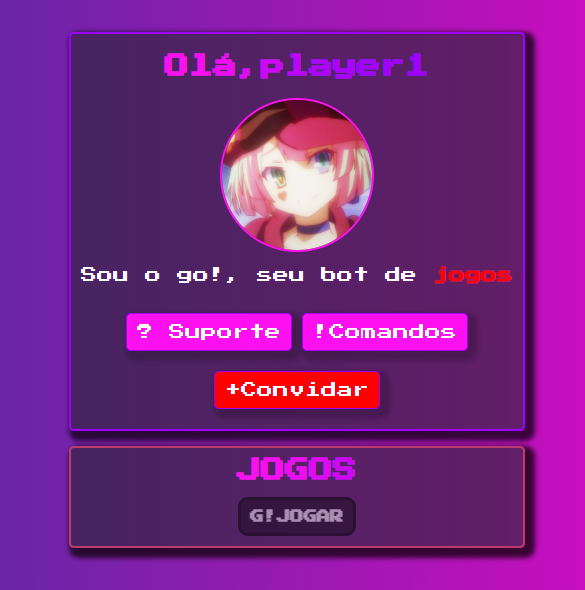

# 🎈| Go!website 
<h2>
  <a href="https://jvrl18.github.io/about-me-html/">
    ---> Acessar website
  </a>
</h2>

---

## ⭐Integrantes: <a href="https://www.linkedin.com/in/joao-vitor-ribeiro-de-lima-dev/">João Vitor Ribeiro</a>

## 📌Descrição
📜| Um site simples para um bot simples
  

💡| Facilita a visualização e interação do usuário final com o Go!
  
## 🛠 Estrutura de pastas
-Raiz 
| 
|-->public 
  &emsp;|-->assets 
  &emsp;|-->css 
  &emsp;|-->script 
  &emsp;|home.html 
  &emsp;|comandos.html 
|readme.md 

## 🗃 Histórico de lançamentos

* 0.0.1 - 26/09/2022
    * Arquivos iniciais

## 📋 Licença/License

<a property="dct:title" rel="cc:attributionURL" href="https://github.com/Spidus/Teste_Final_1">MODELO GIT INTELI</a> by <a rel="cc:attributionURL dct:creator" property="cc:attributionName" href="https://www.yggbrasil.com.br/vr">INTELI, VICTOR BRUNO ALEXANDER ROSETTI DE QUIROZ</a> is licensed under <a href="http://creativecommons.org/licenses/by/4.0/?ref=chooser-v1" target="_blank" rel="license noopener noreferrer" style="display:inline-block;">Attribution 4.0 International</a>

## 🎓 Referências

Aqui estão as referências usadas no projeto.

1. <https://github.com/Intelihub/Template_M1>